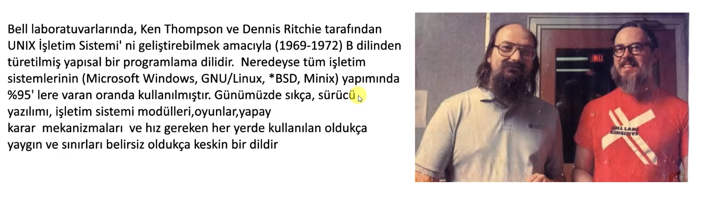
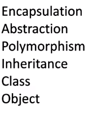

# Engin bilgiler


## C Programlama



## C++ Programlama


## C => C++


## C++ dosya türleri 
`.cc .cpp .c++ .h .hh .hpp .h++ .hxx`

- **.cc :** C++ kaynak kodu dosyasıdır. 
- **.cpp :** C++ kaynak kodu dosyasıdır. 
- **.c++ :** C++ kaynak kodu dosyasıdır. 
`yukarıdaki 3 uzantının arasında hiçbir fark yok. Sadece eskiden daha çok .cc kullanılıyorken şimdilerde .cpp daha sık kullanılıyor`
**.h :** C veya C++ dilinde başlık (header) dosyasını temsil eder. 
**.hpp :** .h ile aynı işlevi görür ancak C++ de tercih edilir. En sık tercih edilen bu
**.hxx :** .h ile aynı işlevi görür ancak C++ de tercih edilir
**.h++ :** .h ile aynı işlevi görür ancak C++ de tercih edilir

## Bellek

RAM'ler 8bitlik hücrelerden oluşuyormuş
32 bitlik veri için 4 farklı hücrenin yeri tutuluyor


## Tamsayı Taşması

standart bir shell programında hata kodları 0-255 aralığında değerlere sahip, minishell yazarken hata kodunu int olarak tanımlamak yerine short olarak tanımlasaydık 256ya göre modunu almakla uğraşmazdık


## PC karakterin kaç bit olduğunu anlıyor

En baştaki bitler o karakterin kaç bayt oldugunu belirliyor
eğer 0 ise bu ascii tablosundan bir karakterdir ve 0-127 arasında değer alır
en baştan kaç biti 1 ise karakter o kadar bayta sahiptir
ve çok baytlı karakterlerde her baytın başındaki iki bit o baytın aynı karaktere ait oldugunu ifade ediyor


## Bool (boolean) veri türü kaç bit ? 

bool veri türü 8 bir yani 1 bayt.
- true ise asciideki '1' karakterini tutuyor yani ramde "0011 0000" şeklinde tutuluyor,
- false ise asciideki '0' karakterini tutuyor yani ramde "0011 0001" şeklinde tutuluyor
Lakin sanırım her bilgisayarda değil :D bazı cihazlarda "0000 0001" ve "0000 0000" şeklinde tutuluyor olabilir ama her halükardad 1 bayt

Because the CPU can't address anything smaller than a byte.
Tarihsel olarak bayt, bir bilgisayardaki tek bir metin karakterini kodlamak için kullanılan bit sayısıydı ve bu nedenle birçok bilgisayar mimarisinde temel adreslenebilir öğedir.
The easiest answer is; it's because the CPU addresses memory in bytes and not in bits, and bitwise operations are very slow.
CPUs as the answers partially-answered correctly are generally aligned to read bytes and RAM/memory is designed in the same way.

Eğer bir int değerin 4, 2 hatta 1 bit olmasını sağlayabilirsin bunun için;
```C++
// 1 byte value (on a system where 8 bits is a byte)
struct SomThing   
{
		int   p1:4;   // 4 bit field
		int   p2:3;   // 3 bit field
		int   p3:1;   // 1 bit
};
```
Yukarıdaki gibi tanımlanan int değerlere bir boolean tipi ataması yapıldığını düşün :D
Boolean 1 bayt
İşlemci otomatik bir tür dönüşümü yapabilir belki
Belkide if (number) gibi kullanımı sağlamak için boolean türünü 1 bayt yaptılar

## Literal Constants, Symbolic Constants

sembolik sabitler const ile tanımlanan sabitlerdir. `const int pi = 3.14 yada #define pi 3.145654345` gibi
Literal sabitler program derlendikten sonra kullanıcının değiştiremediği değerler `bool isActive = true yada std::cout << "hello world"` gibi

## Type casting

implicit conversion
```C++
short a=2000;
int b;
b=a;

// yada

class A {};
class B { public: B (A a) {} };

A a;
B b=a;
```

explicit conversion;
```C++
short a=2000;
int b;
b = (int) a;    // c-like cast notation
b = int (a);    // functional notation
```

Bu explicit operatörlerinin işlevselliği, temel veri türleriyle ilgili çoğu ihtiyaç için yeterlidir. Bununla birlikte, bu operatörler ayrım gözetmeksizin sınıflara ve sınıf işaretçilerine uygulanabilir; bu da sözdizimsel olarak doğru olmasına rağmen <mark> run time hatalarına neden olabilecek kodlara yol açabilir </mark>. Örneğin, aşağıdaki kod sözdizimsel olarak doğrudur:

```c++
// class type-casting
#include <iostream>
using namespace std;

class CDummy {
		float i,j;
};

class CAddition {
	int x,y;
	public:
	CAddition (int a, int b) { x=a; y=b; }
	int result() { return x+y;}
};

int main () {
	CDummy d;
	CAddition * padd;
	padd = (CAddition*) &d;
	cout << padd->result();
	return 0;
}
```

Sınıflar arasındaki bu tür dönüşümleri kontrol etmek için dört özel atama operatörümüz var: Dynamic_cast, reinterpret_cast, static_cast ve const_cast. Formatları köşeli ayraçlar (<>) arasına alınmış yeni türü ve hemen ardından parantezler arasında dönüştürülecek ifadeyi takip etmektir.

*dynamic_cast <new_type> (expression)
reinterpret_cast <new_type> (expression)
static_cast <new_type> (expression)
const_cast <new_type> (expression)*

herbirinin kendine has özellikleri vardır : [link](https://cplusplus.com/doc/oldtutorial/typecasting/)


## Fonksiyonlarda aşırı yükleme

c++ fonksiyonların aşırı yüklenmesini destekliyor
```c++
int topla(int a, int b);
int topla(int ...);
double topla(double ...);
```

## varsayılan parametre

parametreye kullanıcıdan bir değer gelmeme ihtimalinde varsayılan bir değer atayabiliriz
```c++
int ust_al(double a, double b = 1)
{
	double sonuc = 1;
	while (b > 0)
	{
		sonuc *= a;
		b--;
	}
	return (sonuc);
}
```

## parametreye fonksiyon vermek


## inline function (C ve C++'da kullanılabilir)

C Standardına nispeten yeni bir ekleme olan inline anahtar sözcüğü ile, derleyicinin fonksiyon çağrısı yapmak yerine, ilgili yere fonksiyon kodunu yerleştirmesi sağlanabilir. Bu şekilde, fonksiyon çağrısı yapmak yerine, fonksiyonun kodu doğrudan kullanıldığı için, daha verimli bir yürütme sağlanmış olabilir.
Sonuçta, bir fonksiyon çağrısı yapmak belli bir oranda maliyet oluşturan bir işlemdir. Çağrılan fonksiyon büyük ve/veya çağrı sayısı az ise, bu oran düşük kalır ve ciddi bir performans kaybı olarak karşımıza çıkmaz. Ancak, çok sık çağrılan küçük fonksiyonlar için bu maliyet oranı daha önemli hale gelebilir.
Bu sebeplerden ötürü çok sık çağrılan küçük fonksiyonlar inline olarak belirlendiğinde verim artar

Örneğin, aşağıdaki satıriçi fonksiyon verilen üç argümandan en büyüğünü döndürür:
```C
static inline double maks (double a, double b, double c)
{
	double m = (a>b) ? a : b;
	return (m>c) ? m : c;
}
```
Eğer yukarıdaki fonksiyon için derleyiciye verdiğimiz inline önerisi, derleyici tarafından dikkate alınırsa, başka bir fonksiyon içinde yapılan

```C
x = maks(sin(x1), cos(x2), tan(x3));
```
çağrısı yerine, sanki

```C
{
	double a=sin(x1), b=cos(x2), c=tan(x3);
	double m = (a>b) ? a : b;
	x = (m>c) ? m : c;
}
```
kodu yazılmış gibi derlenecektir.

`inline` anahtar sözcüğü, daha önce gördüğümüz `register` anahtar sözcüğü gibi, derleyiciye bir öneri verir. Derleyicinin böyle bir fonksiyonu gerçekten satıriçi yapıp yapmayacağı birçok etkene bağlıdır. Ayrıca, tıpkı `register` gibi kullanımı çoğu zaman gereksizdir; eniyileme yapan iyi bir derleyici normal bir fonksiyonu bile (kullanılan eniyileme seçeneklerine bağlı olarak) bazı kullanımlarda satıriçi bir fonksiyon olarak derleyebilir. İçinde döngü içeren veya özçağrılı fonksiyonların satıriçi yapılması anlamsızdır. Aynı şekilde, farklı dosyalar tarafından kullanılabilecek bir satıriçi fonksiyon tanımının içinde `static` bir değişken tanımlayıp kullanmak veya fonksiyon dışında tanımlanmış bir `static` değişkeni güncellemek, her dosya için diğerinden farklı değişken söz konusu olacağı için kafa karıştırıcı olabilir.

## Stream Giriş/Çıkış Sınıfları ve Nesneleri 
- **`iostream`** kütüphanesi:
	- `<iostream.h>:` cin, cout, cerr, ve clog nesnelerini içerir.
	- cin >> str // bu şekilde aldığımız veri boşluğa kadar olan kısım olacak, cin boşluğa kadar alır
	- özel bir karaktere kadar yada \n yani entera basılana kadar almak istiyorsak getline() kullanacağız
cin, cout, cerr, clog ve kullanıcı tanımlı stream nesneleriyle birlikte kullanılır. 
	- `<iomanip.h>:` parametreleştirilmiş stream manipulatörlerini kapsar
	- `<fstream.h>:` Kullanıcı kontrollü dosya işlemleri için önemli olan bilgileri içerir. 
- **<< (sola kaydırma operatörü):** stream araya sokma (insertion) operatörü varolan türlerin çıktıları için aşırı yüklenmiştir. Kullanıcı tanımlı türlerin çıktıları için de kullanılabilir.
	- cout << ‘\n’; newline character basar (alt satıra götürür imleci)
	- cout << endl; endl bir stream manipulatörüdür ve newline karakteriyle aynı işi yapar ve çıkış buffer boşaltılır
	- cout << flush; flush çıkış buffer boşaltılır 
	- soldan sağa işlem uygulanır ve solundaki işlemci nesneye bir referans döndürür (yani cout’a). 
	<< char * türünden bir değişkeni string gibi basar
- **>> (sağa kaydırma operatörü):** stream araya sokma (extraction) operatörü olarak aşırı yüklenmiştir.
	- 


## Paradigmalar hakkında 
Farklı programlama paradigmaları var ve C++ diğer bir çok programlama dili gibi multparadigmalı bir dil
C++ prosedürel, fonksiyonel, oop, ve generic bir programlama dili iken
C yalnızca prosedürel ve structured bir programlama dilidir

## fstream
Acaba bir işaretçinini string *yaz içine ne kadar yazılabilir, kesinlikle bunun bir sınırı vardır ve aşağıdaki kod bellek yönetimi konusunda kontrolsüz


# OOP



**Sınıflar** constructor, destructorlara çeşitli değişkenlere yada methodlara sahip olabilir.

```cpp

class MerhabaDunya {
private:
		std::string mesaj;
public:
		int selam_count;

		MerhabaDunya()
		{
				mesaj = "Merhaba, Dünya!";
		}
		~MerhabaDunya();
		void MesajiYaz()
		{
				std::cout << mesaj << std::endl;
		}

};

```
##### `NOT : class ların fonksiyonlarına method deniyor`

##### `NOT : bir sınıfı oluşturduysan fakat o sınıfı hiçbiryerde kullanmadıysan methodlar text-segmentinde oluşturulmuyor :D bu neydi şimdi`

##### `namescape : bunun kullanımındaki amaç aynı isme sahip olan ifadelerin birbirleri ile karışmamasıdır. Kendimizde namespace oluşturabiliriz` 


```cpp

using namespace std;

namespace talha {
    int power = 9999;

    void selam() {
        cout << "ESSALAMU SELAMUN ALEYKÜM VE RAHMETULLAH" << endl;
    }
}

int main()
{
	cout << talha::power << endl;
	talha::selam();
}
```


<strong>VIRTUAL : </strong> Bir sınıfın üyesi olan bir fonksiyonun, türetilmiş sınıflar tarafından yeniden tanımlanabileceğini ve bu yeniden tanımlama işleminin dinamik olarak yönlendirilebileceğini belirtir.


**Erişim belirteçleri ;**


**Constructor&Destructor / Kurucu&Yıkıcı Fonksiyonlar**

nesne oluşturulunca constructor, parantez kapsamı bitince destructor çalışacak


Destructor'a herhangi bir parametre verilemiyor

**Inheritance / Kalıtım**


Kalıtım ve ram ilişkisi;


Sınıflar başlarken 
önce base class'ın Constructor'ı çalışır,
biterken ise
önce alt classların Destructor'ı çalışır en son base classın Destructor'ı çalışır

**Sınıflar arası tür dönüşümü**

sınıflar arası cast yapılırken kalıtım ilişkisi olan sınıflar üzerinden yapılmalıdır. Aksi halde beklenmeyen sonuçlar alınır

`downcasting` yapılırken dikkatli olunmalı 
üst sınıf alt sınıfın özelliklerini içermiyor bu yüzden eğer illa downcast yapılacaksa 
daha önceden üst sınıf olan obje üst sınıfa downcast ile yeniden dönüştürüldüğünde problem çıkmayacaktır


`Upcasting örnekleri;`
```cpp
// class Animal
// class Dog: public Animal { ...
// ...
// ...
// ...
    // ! UPCASTİNG
	Animal *a1 = new Cat(); // a1 animal sınıfından bir nesneye dönüşüyor artık Cat özelliklerine ulaşamıyoruz
    // ! UPCASTİNG
    Cat cat;
    Animal *a2 = &cat; // a2 animal sınıfından bir nesneye dönüşüyor artık Cat özelliklerine ulaşamıyoruz


	// Aynı şekilde Dog sınıfı içinde upcasting örnekleri
	// DİKKAT hiçbirşekilde type-casting operatörü kullanmadığımıza dikkat et, otomatik şekilde gerçekleştirildiler
    // ! UPCASTİNG
	Animal& AnimalRef = dog; // No cast required. (Dogs are animals).
    // ! UPCASTİNG
    Animal* AnimalPtr = &dog; // No cast required. (Dogs are animals).

```

`alt sınıflar arasında tür dönüşümü yapılmamalı (örn cat ile dog arasında bir cast); derleyici Warning verir`


**Kapsülleme / Encapsulation**

setter/getter metodları ile sınıf içerisindeki değişkenlere daha kontrollü erişim sağlarız. Bunu kapsülleme ile yapacağız

```cpp
class Rectangle {
	private:
		int length;
		int breadth;

	public:
		int getArea() {
			return length * breadth;
		}
};
```

Bu örnekte, length ve breadth veri üyeleri ve bu verileri işleyen getArea fonksiyonu, Rectangle sınıfı içinde kapsüllenmiştir. length ve breadth değişkenlerine doğrudan erişim yok yalnızca bir getArea metodu ile erişim var

Kapsüllemenin iki önemli özelliği vardır:

- <mark>Veri Koruma:</mark> Kapsülleme, bir nesnenin iç durumunu, veri üyelerini private olarak saklayarak korur. Bu veri üyelerine erişim ve değişiklik, sınıfın public metotlarına sınırlıdır, bu da kontrollü ve güvenli veri manipülasyonunu sağlar.
- <mark>Bilgi Gizleme:</mark> Kapsülleme, bir sınıfın iç uygulama detaylarını dış koddan gizler. Sadece sınıfın public arayüzüne erişilebilir, bu da sınıfın kullanımını basitleştirir ve iç uygulamanın dış kodu etkilemeden değiştirilmesine izin verir.


https://en.cppreference.com/w/cpp/string/basic_string
https://www.youtube.com/watch?v=HwtFcT-ueu8&ab_channel=BoQian