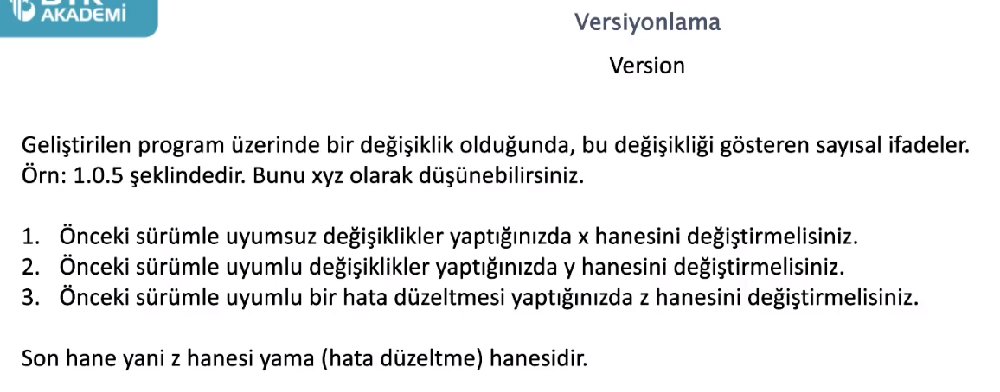
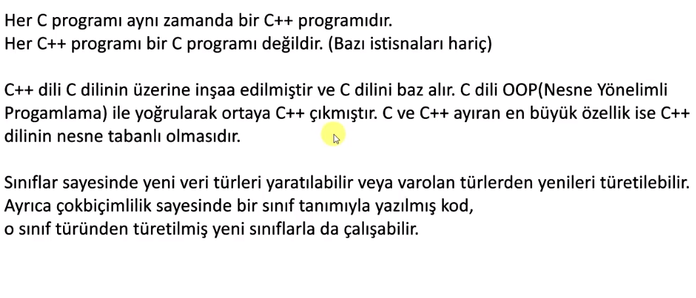
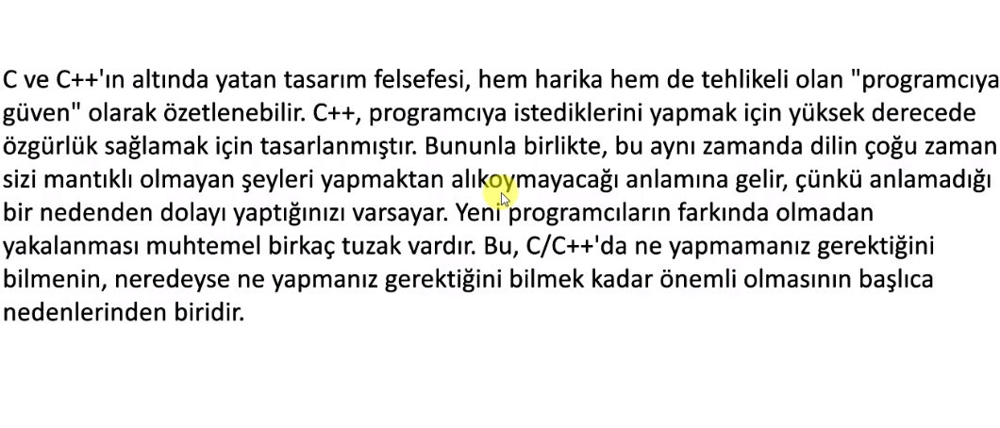
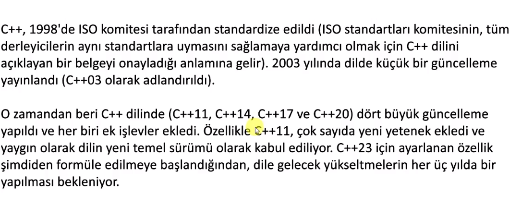
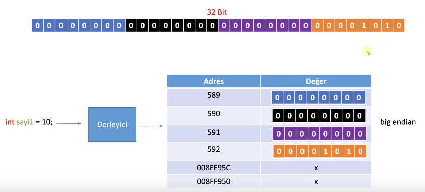
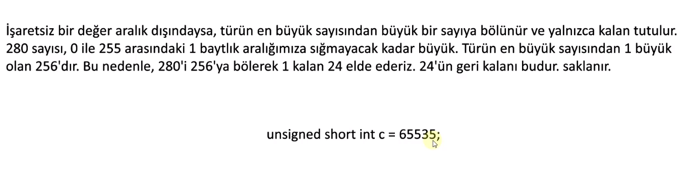
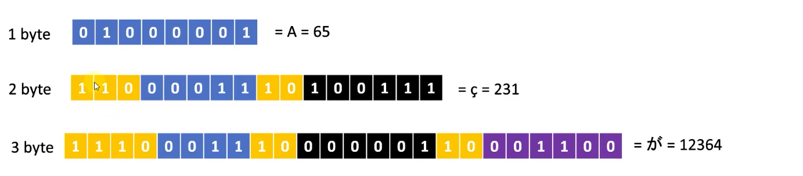
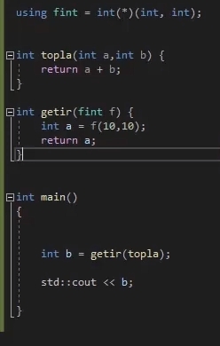
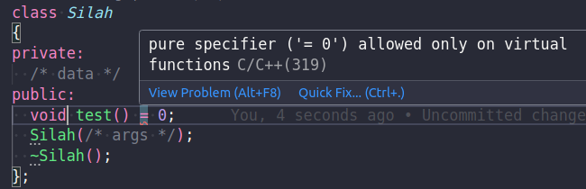

# Engin bilgiler



## C Programlama


## C++ Programlama


## C => C++





## C++ dosya türleri 
`.cc .cpp .c++ .h .hh .hpp .h++ .hxx`

- **.cc :** C++ kaynak kodu dosyasıdır. 
- **.cpp :** C++ kaynak kodu dosyasıdır. 
- **.c++ :** C++ kaynak kodu dosyasıdır. 
`yukarıdaki 3 uzantının arasında hiçbir fark yok. Sadece eskiden daha çok .cc kullanılıyorken şimdilerde .cpp daha sık kullanılıyor`
**.h :** C veya C++ dilinde başlık (header) dosyasını temsil eder. 
**.hpp :** .h ile aynı işlevi görür ancak C++ de tercih edilir. En sık tercih edilen bu
**.hxx :** .h ile aynı işlevi görür ancak C++ de tercih edilir
**.h++ :** .h ile aynı işlevi görür ancak C++ de tercih edilir

## Bellek

RAM'ler 8bitlik hücrelerden oluşuyormuş
32 bitlik veri için 4 farklı hücrenin yeri tutuluyor


## Tamsayı Taşması

standart bir shell programında hata kodları 0-255 aralığında değerlere sahip, minishell yazarken hata kodunu int olarak tanımlamak yerine short olarak tanımlasaydık 256ya göre modunu almakla uğraşmazdık


## PC karakterin kaç bit olduğunu anlıyor

En baştaki bitler o karakterin kaç bayt oldugunu belirliyor
eğer 0 ise bu ascii tablosundan bir karakterdir ve 0-127 arasında değer alır
en baştan kaç biti 1 ise karakter o kadar bayta sahiptir
ve çok baytlı karakterlerde her baytın başındaki iki bit o baytın aynı karaktere ait oldugunu ifade ediyor


## Bool (boolean) veri türü kaç bit ? 

bool veri türü 8 bir yani 1 bayt.
- true ise asciideki '1' karakterini tutuyor yani ramde "0011 0000" şeklinde tutuluyor,
- false ise asciideki '0' karakterini tutuyor yani ramde "0011 0001" şeklinde tutuluyor
Lakin sanırım her bilgisayarda değil :D bazı cihazlarda "0000 0001" ve "0000 0000" şeklinde tutuluyor olabilir ama her halükardad 1 bayt

Because the CPU can't address anything smaller than a byte.
Tarihsel olarak bayt, bir bilgisayardaki tek bir metin karakterini kodlamak için kullanılan bit sayısıydı ve bu nedenle birçok bilgisayar mimarisinde temel adreslenebilir öğedir.
The easiest answer is; it's because the CPU addresses memory in bytes and not in bits, and bitwise operations are very slow.
CPUs as the answers partially-answered correctly are generally aligned to read bytes and RAM/memory is designed in the same way.

Eğer bir int değerin 4, 2 hatta 1 bit olmasını sağlayabilirsin bunun için;
```C++
// 1 byte value (on a system where 8 bits is a byte)
struct SomThing   
{
		int   p1:4;   // 4 bit field
		int   p2:3;   // 3 bit field
		int   p3:1;   // 1 bit
};
```
Yukarıdaki gibi tanımlanan int değerlere bir boolean tipi ataması yapıldığını düşün :D
Boolean 1 bayt
İşlemci otomatik bir tür dönüşümü yapabilir belki
Belkide if (number) gibi kullanımı sağlamak için boolean türünü 1 bayt yaptılar

## Literal Constants, Symbolic Constants

sembolik sabitler const ile tanımlanan sabitlerdir. `const int pi = 3.14 yada #define pi 3.145654345` gibi
Literal sabitler program derlendikten sonra kullanıcının değiştiremediği değerler `bool isActive = true yada std::cout << "hello world"` gibi

## Type casting

implicit conversion
```C++
short a=2000;
int b;
b=a;

// yada

class A {};
class B { public: B (A a) {} };

A a;
B b=a;
```

explicit conversion;
```C++
short a=2000;
int b;
b = (int) a;    // c-like cast notation
b = int (a);    // functional notation
```

Bu explicit operatörlerinin işlevselliği, temel veri türleriyle ilgili çoğu ihtiyaç için yeterlidir. Bununla birlikte, bu operatörler ayrım gözetmeksizin sınıflara ve sınıf işaretçilerine uygulanabilir; bu da sözdizimsel olarak doğru olmasına rağmen <mark> run time hatalarına neden olabilecek kodlara yol açabilir </mark>. Örneğin, aşağıdaki kod sözdizimsel olarak doğrudur:

```c++
// class type-casting
#include <iostream>
using namespace std;

class CDummy {
		float i,j;
};

class CAddition {
	int x,y;
	public:
	CAddition (int a, int b) { x=a; y=b; }
	int result() { return x+y;}
};

int main () {
	CDummy d;
	CAddition * padd;
	padd = (CAddition*) &d;
	cout << padd->result();
	return 0;
}
```

Sınıflar arasındaki bu tür dönüşümleri kontrol etmek için dört özel atama operatörümüz var: Dynamic_cast, reinterpret_cast, static_cast ve const_cast. Formatları köşeli ayraçlar (<>) arasına alınmış yeni türü ve hemen ardından parantezler arasında dönüştürülecek ifadeyi takip etmektir.

*dynamic_cast <new_type> (expression)
reinterpret_cast <new_type> (expression)
static_cast <new_type> (expression)
const_cast <new_type> (expression)*

herbirinin kendine has özellikleri vardır : [link](https://cplusplus.com/doc/oldtutorial/typecasting/)


## Fonksiyonlarda aşırı yükleme

c++ fonksiyonların aşırı yüklenmesini destekliyor
```c++
int topla(int a, int b);
int topla(int ...);
double topla(double ...);
```

## varsayılan parametre

parametreye kullanıcıdan bir değer gelmeme ihtimalinde varsayılan bir değer atayabiliriz
```c++
int ust_al(double a, double b = 1)
{
	double sonuc = 1;
	while (b > 0)
	{
		sonuc *= a;
		b--;
	}
	return (sonuc);
}
```

## parametreye fonksiyon vermek



## inline function (C ve C++'da kullanılabilir)

C Standardına nispeten yeni bir ekleme olan inline anahtar sözcüğü ile, derleyicinin fonksiyon çağrısı yapmak yerine, ilgili yere fonksiyon kodunu yerleştirmesi sağlanabilir. Bu şekilde, fonksiyon çağrısı yapmak yerine, fonksiyonun kodu doğrudan kullanıldığı için, daha verimli bir yürütme sağlanmış olabilir.
Sonuçta, bir fonksiyon çağrısı yapmak belli bir oranda maliyet oluşturan bir işlemdir. Çağrılan fonksiyon büyük ve/veya çağrı sayısı az ise, bu oran düşük kalır ve ciddi bir performans kaybı olarak karşımıza çıkmaz. Ancak, çok sık çağrılan küçük fonksiyonlar için bu maliyet oranı daha önemli hale gelebilir.
Bu sebeplerden ötürü çok sık çağrılan küçük fonksiyonlar inline olarak belirlendiğinde verim artar

Örneğin, aşağıdaki satıriçi fonksiyon verilen üç argümandan en büyüğünü döndürür:
```C
static inline double maks (double a, double b, double c)
{
	double m = (a>b) ? a : b;
	return (m>c) ? m : c;
}
```
Eğer yukarıdaki fonksiyon için derleyiciye verdiğimiz inline önerisi, derleyici tarafından dikkate alınırsa, başka bir fonksiyon içinde yapılan

```C
x = maks(sin(x1), cos(x2), tan(x3));
```
çağrısı yerine, sanki

```C
{
	double a=sin(x1), b=cos(x2), c=tan(x3);
	double m = (a>b) ? a : b;
	x = (m>c) ? m : c;
}
```
kodu yazılmış gibi derlenecektir.

`inline` anahtar sözcüğü, daha önce gördüğümüz `register` anahtar sözcüğü gibi, derleyiciye bir öneri verir. Derleyicinin böyle bir fonksiyonu gerçekten satıriçi yapıp yapmayacağı birçok etkene bağlıdır. Ayrıca, tıpkı `register` gibi kullanımı çoğu zaman gereksizdir; eniyileme yapan iyi bir derleyici normal bir fonksiyonu bile (kullanılan eniyileme seçeneklerine bağlı olarak) bazı kullanımlarda satıriçi bir fonksiyon olarak derleyebilir. İçinde döngü içeren veya özçağrılı fonksiyonların satıriçi yapılması anlamsızdır. Aynı şekilde, farklı dosyalar tarafından kullanılabilecek bir satıriçi fonksiyon tanımının içinde `static` bir değişken tanımlayıp kullanmak veya fonksiyon dışında tanımlanmış bir `static` değişkeni güncellemek, her dosya için diğerinden farklı değişken söz konusu olacağı için kafa karıştırıcı olabilir.

## std::string 

C++'da `std::string` sınıfı, stringlerle çalışmayı kolaylaştıran bir dizi fonksiyon sağlar¹²³. İşte `std::string` sınıfının en önemli fonksiyonlarından bazıları:

1. **`length()` ve `size()`**¹: Bu fonksiyonlar, bir stringin uzunluğunu (karakter sayısını) döndürür¹.

2. **`empty()`**¹: Bu fonksiyon, bir stringin boş olup olmadığını kontrol eder¹.

3. **`append()` ve `operator+=`**¹: Bu fonksiyonlar, bir stringin sonuna başka bir string ekler¹.

4. **`insert()`**¹: Bu fonksiyon, bir stringin belirli bir konumuna başka bir string ekler¹.

5. **`erase()`**¹: Bu fonksiyon, bir stringin belirli bir kısmını siler¹.

6. **`replace()`**¹: Bu fonksiyon, bir stringin belirli bir kısmını başka bir string ile değiştirir¹.

7. **`substr()`**¹: Bu fonksiyon, bir stringin belirli bir alt stringini alır¹.

8. **`find()` ve `rfind()`**¹: Bu fonksiyonlar, bir string içinde başka bir stringin ilk (`find()`) veya son (`rfind()`) konumunu bulur¹.

9. **`compare()`**¹: Bu fonksiyon, iki stringi karşılaştırır¹.

10. **`c_str()`**¹: Bu fonksiyon, bir stringin C-string (null ile sonlandırılmış karakter dizisi) karşılığını döndürür¹.

Bu fonksiyonlar, bir `std::string` nesnesi üzerinde çeşitli işlemler gerçekleştirmenizi sağlar. Her zaman hangi fonksiyonun en uygun olduğunu belirlemek için gereksinimlerinizi ve kısıtlamalarınızı göz önünde bulundurun.

Source: Conversation with Bing, 1/2/2024
(1) std::string class in C++ - GeeksforGeeks. https://www.geeksforgeeks.org/stdstring-class-in-c/.
(2) C++ String – std::string Example in C++ - freeCodeCamp.org. https://www.freecodecamp.org/news/c-string-std-string-example-in-cpp/.
(3) string - cplusplus.com - The C++ Resources Network. https://cplusplus.com/reference/string/string/.
(4) Strings in C++ - GeeksforGeeks. https://www.geeksforgeeks.org/strings-in-cpp/.

## Stream Giriş/Çıkış Sınıfları ve Nesneleri

##### `namescape : bunun kullanımındaki amaç aynı isme sahip olan ifadelerin birbirleri ile karışmamasıdır. Kendimizde namespace oluşturabiliriz` 


```cpp

using namespace std;

namespace talha {
    int power = 9999;

    void selam() {
        cout << "ESSALAMU SELAMUN ALEYKÜM VE RAHMETULLAH" << endl;
    }
}

int main()
{
	cout << talha::power << endl;
	talha::selam();
}
```
- **`iostream`** kütüphanesi:
	- `<iostream.h>:` cin, cout, cerr, ve clog nesnelerini içerir.
	- cin >> str // bu şekilde aldığımız veri boşluğa kadar olan kısım olacak, cin boşluğa kadar alır
	- özel bir karaktere kadar yada \n yani entera basılana kadar almak istiyorsak getline() kullanacağız
cin, cout, cerr, clog ve kullanıcı tanımlı stream nesneleriyle birlikte kullanılır. 
	- `<iomanip.h>:` parametreleştirilmiş stream manipulatörlerini kapsar
	- `<fstream.h>:` Kullanıcı kontrollü dosya işlemleri için önemli olan bilgileri içerir. 
- **<< (sola kaydırma operatörü):** stream araya sokma (insertion) operatörü varolan türlerin çıktıları için aşırı yüklenmiştir. Kullanıcı tanımlı türlerin çıktıları için de kullanılabilir.
	- cout << ‘\n’; newline character basar (alt satıra götürür imleci)
	- cout << endl; endl bir stream manipulatörüdür ve newline karakteriyle aynı işi yapar ve çıkış buffer boşaltılır
	- cout << flush; flush çıkış buffer boşaltılır 
	- soldan sağa işlem uygulanır ve solundaki işlemci nesneye bir referans döndürür (yani cout’a). 
	<< char * türünden bir değişkeni string gibi basar
- **>> (sağa kaydırma operatörü):** stream araya sokma (extraction) operatörü olarak aşırı yüklenmiştir.
	- 


## Paradigmalar hakkında 
Farklı programlama paradigmaları var ve C++ diğer bir çok programlama dili gibi multparadigmalı bir dil
C++ prosedürel, fonksiyonel, oop, ve generic bir programlama dili iken
C yalnızca prosedürel ve structured bir programlama dilidir

## Dosya işlemleri ~ fstream

C++'da dosya işlemleri genellikle `fstream` kütüphanesi ile gerçekleştirilir¹². Bu kütüphane, dosyaları okumak ve yazmak için kullanılan `ifstream`, `ofstream` ve `fstream` sınıflarını içerir¹².

Bununla birlikte, C++'da C dilinin dosya işlemleri de kullanılabilir¹. C dilinde dosya işlemleri için `stdio.h` kütüphanesinde yer alan `fopen`, `fclose`, `fread`, `fwrite`, `fprintf`, `fscanf` gibi fonksiyonlar kullanılır¹. Bu fonksiyonlar, C++'da da kullanılabilir¹.

Ancak, genellikle C++'da `fstream` kütüphanesi tercih edilir çünkü bu kütüphane, C++'nın nesne yönelimli özelliklerini destekler ve daha güvenli ve esnek bir API sağlar¹².

Source: Conversation with Bing, 1/2/2024
(1) C++ Dosya İşlemleri - Yusuf SEZER. https://www.yusufsezer.com.tr/cpp-dosya-islemleri/.
(2) C++ Dosya İşlemleri. C++ dilinde, dosya işleme işlemleri… | by Eren .... https://medium.com/@erenerdogan037/c-dosya-i̇şlemleri-ade2b0c9d9a8.

Acaba bir işaretçinini string *yaz içine ne kadar yazılabilir, kesinlikle bunun bir sınırı vardır ve aşağıdaki kod bellek yönetimi konusunda kontrolsüz


# OOP


## **Sınıflar** 
constructor, destructorlara çeşitli değişkenlere yada methodlara sahip olabilir.

```cpp

class MerhabaDunya {
private:
		std::string mesaj;
public:
		int selam_count;

		MerhabaDunya()
		{
				mesaj = "Merhaba, Dünya!";
		}
		~MerhabaDunya();
		void MesajiYaz()
		{
				std::cout << mesaj << std::endl;
		}

};

```
##### `NOT : class ların fonksiyonlarına method deniyor`

##### `NOT : bir sınıfı oluşturduysan fakat o sınıfı hiçbiryerde kullanmadıysan methodlar text-segmentinde oluşturulmuyor` 

**Erişim belirteçleri ;**
`NOT : eğer erişim belirteci kullanmazsan varsayılan olarak private kabul edilir.`


**Constructor&Destructor / Kurucu&Yıkıcı Fonksiyonlar**

nesne oluşturulunca constructor, parantez kapsamı bitince destructor çalışacak


Destructor'a herhangi bir parametre verilemiyor

Sınıflar başlarken 
önce base class'ın Constructor'ı çalışır,
biterken ise
önce alt classların Destructor'ı çalışır en son base classın Destructor'ı çalışır

## **Polymorphism (Çok biçimlilik)**

Bir operatör, fonksiyon yada metod çok biçimli olabilir. Kullanma şekline göre hangi biçiminin çalışacağı belirlenir.


- `Compile-time Polymorphism : ` Bu tür polimorfizm, fonksiyonun aşırı yüklenmesi veya operatörün aşırı yüklenmesiyle elde edilir.

	1) Fonksiyonlarda aşırı yükleme (function overloading)=> [LINK](#fonksiyonlarda-aşırı-yükleme)

	2) Operatörlerde aşırı yükleme (operator overloading)=> [LINK](https://www.geeksforgeeks.org/operator-overloading-cpp/)

- `Runtime Polymorphism : ` fonksiyon yada değişken geçersiz kılma ile elde edilir. Late binding and dynamic polymorphism are other names for runtime polymorphism. İşlev çağrısı, runtime polimorfizminde runtimeda çözümlenir. Bunun aksine, complie time polimorfizminde derleyici, runtimeda çıkarım yaptıktan sonra nesneye hangi işlev çağrısının bağlanacağını belirler.
```cpp
// C++ program for function overriding with data members
#include <bits/stdc++.h>
using namespace std;

// base class declaration.
class Animal {
public:
	string color = "Black";
};

// inheriting Animal class.
class Dog : public Animal {
public:
	string color = "Grey";
};

// Driver code
int main(void)
{
	Animal d = Dog(); // accessing the field by reference
					// variable which refers to derived
	cout << d.color;
}

```


**`VIRTUAL` anahtar kelimesi :** Bir sınıfın üyesi olan bir fonksiyonun, türetilmiş sınıflar tarafından yeniden tanımlanabileceğini ve bu yeniden tanımlama işleminin dinamik olarak yönlendirilebileceğini belirtir. Yalnızca fonksiyonlarla kullanılır.

- Virtual functions are Dynamic in nature. 
- They are defined by inserting the keyword “virtual” inside a base class and are always declared with a base class and overridden in a child class
- A virtual function is called during Runtime


Yukarıdaki sınıflarda ates metodu virtual ve bu sayede tüm subclassları parametre olrak alabilen atesEt metodu istediğimiz sınıfın ates metodunu çalıştıracak
Virtual olan metodu yukarıdaki gibi gövdesiz yaparsak bu sınıf soyut bir sınıftır. Soyut sınıftan miras alan tüm sınıflarda bu metodu override etmek zorunda etmezse onlarda soyut sınıftır ve soyut sınıflardan nesne üretilemez.

Virtual anahtar kelimesi kullanıldıgında sınıf içerisinde _vPtr adında bir işaretçi oluşturuluyor, bu işaretçi vTable ı işaret ediyor ve silah sınıfının ates metodu çağrıldıgında bu tablodan ilgili metodun adresi bulunup o metod çalıştırılıyor. Her yeni nesne oluşturulduğunda vTableı işaret eden yeni bir _vPtr oluşturulur
Hangi metodun çağrılacağı derlemede belirlenmez çalışma zamanında belirlenir.


konu hakkında => [LINK](https://www.equestionanswers.com/cpp/vptr-and-vtable.php)
konu hakkında => [LINK GeeksFG](https://www.geeksforgeeks.org/vtable-and-vptr-in-cpp/)

## **Inheritance / Kalıtım**

c++ da miras alma şekli
```cpp
class  <derived_class_name> : <access-specifier> <base_class_name>
{
	//body
}
```

**`miras alırken erişim belirteçleri`**

1. **Private Miras**: `class ABC : private XYZ`¹
    - Bu durumda, `XYZ` sınıfının tüm `public` ve `protected` üyeleri `ABC` sınıfında `private` olarak miras alınır¹.
    - Bu, `ABC` sınıfının dışından bu üyelere erişilemeyeceği anlamına gelir¹.

2. **Public Miras**: `class ABC : public XYZ`¹
    - Bu durumda, `XYZ` sınıfının `public` üyeleri `ABC` sınıfında `public` olarak, `protected` üyeleri ise `protected` olarak miras alınır¹.
    - Bu, `ABC` sınıfının dışından `public` üyelere erişilebileceği anlamına gelir¹.

3. **Protected Miras**: `class ABC : protected XYZ`¹
    - Bu durumda, `XYZ` sınıfının `public` ve `protected` üyeleri `ABC` sınıfında `protected` olarak miras alınır¹.
    - Bu, `ABC` sınıfının dışından bu üyelere erişilemeyeceği, ancak `ABC`'den türetilmiş sınıfların bu üyelere erişebileceği anlamına gelir¹.

4. **Default**: `class ABC: XYZ`¹
    - Eğer erişim belirteci belirtilmezse (örneğin, `public`, `private` veya `protected`), C++'da varsayılan olarak `private` miras alınır¹.
    - Bu, `class ABC: XYZ` ifadesinin `class ABC : private XYZ` ile aynı olduğu anlamına gelir¹.

**`Miras alırken karşılaşılabilecek bir problem ; `**

```cpp
// C++ program demonstrating ambiguity in Multipath 
// Inheritance 

#include <iostream> 
using namespace std; 

class ClassA { 
public: 
	int a; 
}; 

// class ClassB : virtual public ClassA 
// { 
//   public: 
//     int b; 
// }; 
  
// class ClassC : virtual public ClassA 
// { 
//   public: 
//     int c; 
// };

class ClassB : public ClassA { 
public: 
	int b; 
}; 

class ClassC : public ClassA { 
public: 
	int c; 
}; 

class ClassD : public ClassB, public ClassC { 
public: 
	int d; 
}; 

int main() 
{ 
	ClassD obj; 

	// obj.a = 10;				 // Statement 1, Error 
	// obj.a = 100;				 // Statement 2, Error 
	// yukarıdaki hataları almak istemiyorsak iki farklı çözümden birini uygulayabiliriz;
	// 1. sınıfları miras alırken virtual olarak miras almak
	// 2. aşağıdaki gibi hangi sınıftan alınan değişkeni kullanacağını belirtmek

	obj.ClassB::a = 10; // Statement 3 
	obj.ClassC::a = 100; // Statement 4 

	obj.b = 20; 
	obj.c = 30; 
	obj.d = 40; 

	cout << " a from ClassB : " << obj.ClassB::a; 
	cout << "\n a from ClassC : " << obj.ClassC::a; 

	cout << "\n b : " << obj.b; 
	cout << "\n c : " << obj.c; 
	cout << "\n d : " << obj.d << '\n'; 
}

```

Kalıtım ve ram ilişkisi;


**Sınıflar arası tür dönüşümü**

sınıflar arası cast yapılırken kalıtım ilişkisi olan sınıflar üzerinden yapılmalıdır. Aksi halde beklenmeyen sonuçlar alınır

`downcasting` yapılırken dikkatli olunmalı 
üst sınıf alt sınıfın özelliklerini içermiyor bu yüzden eğer illa downcast yapılacaksa 
daha önceden üst sınıf olan obje üst sınıfa downcast ile yeniden dönüştürüldüğünde problem çıkmayacaktır


`Upcasting örnekleri;`
```cpp
// class Animal
// class Dog: public Animal { ...
// ...
// ...
// ...
    // ! UPCASTİNG
	Animal *a1 = new Cat(); // a1 animal sınıfından bir nesneye dönüşüyor artık Cat özelliklerine ulaşamıyoruz
    // ! UPCASTİNG
    Cat cat;
    Animal *a2 = &cat; // a2 animal sınıfından bir nesneye dönüşüyor artık Cat özelliklerine ulaşamıyoruz


	// Aynı şekilde Dog sınıfı içinde upcasting örnekleri
	// DİKKAT hiçbirşekilde type-casting operatörü kullanmadığımıza dikkat et, otomatik şekilde gerçekleştirildiler
    // ! UPCASTİNG
	Animal& AnimalRef = dog; // No cast required. (Dogs are animals).
    // ! UPCASTİNG
    Animal* AnimalPtr = &dog; // No cast required. (Dogs are animals).

```

`alt sınıflar arasında tür dönüşümü yapılmamalı (örn cat ile dog arasında bir cast); derleyici Warning verir`


## **Kapsülleme / Encapsulation**

setter/getter metodları ile sınıf içerisindeki değişkenlere daha kontrollü erişim sağlarız. Bunu kapsülleme ile yapacağız

```cpp
class Rectangle {
	private:
		int length;
		int breadth;

	public:

	//getArea yalnızca sınıf içindeki değişkenleri kullanmalıdır, ancak o zaman buna kapsülleme denir.
		int getArea() {
			return length * breadth;
		}
	// sınıf içindeki değişkenleri kullanan bir fonksiyon yapmazsak buna kapsülleme demeyiz.
};
```

Bu örnekte, length ve breadth veri üyeleri ve bu verileri işleyen getArea fonksiyonu, Rectangle sınıfı içinde kapsüllenmiştir. length ve breadth değişkenlerine doğrudan erişim yok yalnızca bir getArea metodu ile erişim var

Kapsüllemenin iki önemli özelliği vardır:

- <mark>Veri Koruma:</mark> Kapsülleme, bir nesnenin iç durumunu, veri üyelerini private olarak saklayarak korur. Bu veri üyelerine erişim ve değişiklik, sınıfın public metotlarına sınırlıdır, bu da kontrollü ve güvenli veri manipülasyonunu sağlar.
- <mark>Bilgi Gizleme:</mark> Kapsülleme, bir sınıfın iç uygulama detaylarını dış koddan gizler. Sadece sınıfın public arayüzüne erişilebilir, bu da sınıfın kullanımını basitleştirir ve iç uygulamanın dış kodu etkilemeden değiştirilmesine izin verir.

Kapsülleme aynı zamanda veri soyutlamasına da yol açar. Kapsülleme kullanıldığında veriler de gizlenir

## **Soyutlama / Abstraction**

Bir sınıfı yada herhangi yapıyı kullanırken arka planda nasıl çalıştığını hangi özellikleri ve metodları içerdiğini bilmemize gerek yok. Sadece ne işe yaradığını bilmemiz yeterli. 
Örneğin pow() metodunu kullanırken nasıl bir algoritma ile bu işlemin gerçekleştiğini bilmemize gerek yoktur
Bir veriyi soyutlamayı sınıfla,r header filelar yada Access Specifiers yardımı ile yapabiliriz

- İçinde virtual keywordu bulunan gövdesiz metodların olduğu sınıf soyut sınıftır. (`virtual void run() = 0` gibi)
- Soyut sınıflardan nesne üretilemez. Bu sınıflar nesne üretmek için değil diğer sınıfları düzenlemek içindir
- Soyut sınıftan miras alan sınıflar var olan virtual metodları override etmez ise onlarda soyuttur
- Soyut sınıf ile interface arasındaki fark
	=> eğer sınıf içerisinde değişken barındırmıyorsa interface, değişkenlerde barındırıyorsa sadece soyut sınıftır
- Soyut sınıf çeşitli değişken ve metod barındırabilir, soyut olması için yalnızca (`virtual void run() = 0` gibi) bir metod yeterlidir

## Sınıflarda const

Sınıf içerisinde bir metod const olduğunda ;
```cpp
class MyClass {
private:
    int value;
public:
    MyClass(int v) : value(v) {}
    int get() const { return value; }  // const fonksiyon
	// const olan fonksiyon içerisinde sınıfın değişkenleri değiştirilemez sabit kalır. Bu bir private değişkenin olası şekilde yanlışlıkla değiştirilme durumunu ortadan kaldırır
};
```
`NOT : const ifadesinin başta ortada vs kullanımı birbirinden farklı anlamlara gelir`
Aşağıdaki kullanımda ptr değiştirilemez ama ptr'nin işaret ettiği değer değiştirilebilir


Aşağıdaki kullanımda ise ptr'nin hiçbir şekilde değiştirilmesine izin verilmiyor


Aşağıdaki kullanımda get metodundan return edlien değerin yalnızca const bir değişkene ataması yapılabilr


## Friend fonksiyon ve friend class


## Pure specifier

https://en.cppreference.com/w/cpp/string/basic_string
https://www.youtube.com/watch?v=HwtFcT-ueu8&ab_channel=BoQian